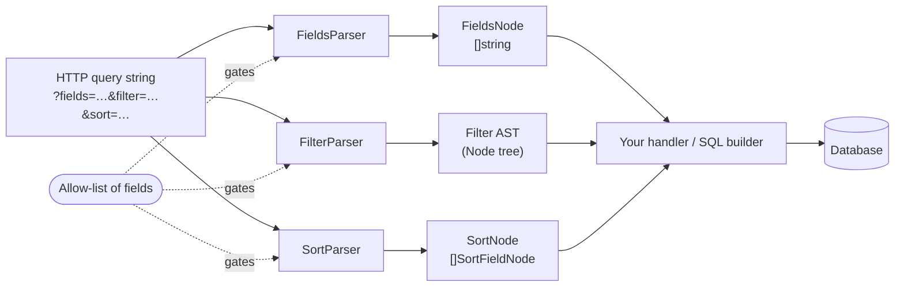
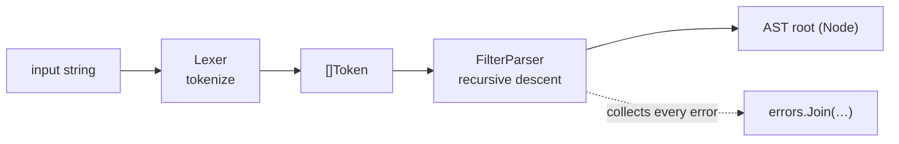

# Query Filters Validator (QFV)

[](https://pkg.go.dev/github.com/slashdevops/qfv)

[](https://github.com/slashdevops/qfv/blob/main/LICENSE)
[](https://github.com/slashdevops/qfv/actions/workflows/release.yml)
[](https://github.com/slashdevops/qfv/releases)

A Go library for parsing and validating the query expressions commonly used in
REST APIs and database queries — **fields selection**, **filtering**, and
**sorting**. Each parser is driven by an allow-list of fields, so only fields you
permit can appear in a query, helping secure your endpoints against invalid or
malicious input.

## Install

```bash
go get github.com/slashdevops/qfv@latest
```

Update to the latest release with `go get -u github.com/slashdevops/qfv@latest`.

## Quick start

```go
package main

import (
    "fmt"
    "log"

    qfv "github.com/slashdevops/qfv"
)

func main() {
    allowedFields := []string{"first_name", "last_name", "email", "created_at"}

    // Parsers are safe to build once and reuse across goroutines.
    filterParser := qfv.NewFilterParser(allowedFields)
    sortParser := qfv.NewSortParser(allowedFields)
    fieldsParser := qfv.NewFieldsParser(allowedFields)

    node, err := filterParser.Parse("first_name = 'John' AND created_at > '2023-01-01'")
    if err != nil {
        log.Fatal(err)
    }
    fmt.Println(node.String()) // ((first_name = 'John') AND (created_at > '2023-01-01'))

    if _, err := sortParser.Parse("first_name ASC, created_at DESC"); err != nil {
        log.Fatal(err)
    }
    if _, err := fieldsParser.Parse("first_name, last_name, email"); err != nil {
        log.Fatal(err)
    }
}
```

## Features

- **Three validators** — fields selection, filtering, and sorting, each gated by
  an allow-list of fields (nested dot-notation like `user.profile.age` supported).
- **Rich, PostgreSQL-flavored filter grammar** — comparison, logical, `IN`,
  `BETWEEN [SYMMETRIC]`, `LIKE`/`ILIKE`, `SIMILAR TO`, POSIX regex, `IS NULL`,
  `IS [NOT] TRUE/FALSE/UNKNOWN`, and `IS [NOT] DISTINCT FROM`.
- **Configurable** — restrict which operators or sort directions are allowed.
- **Returns an AST** you can walk or render, with precise, aggregated errors.
- **Concurrency-safe** parsers.

## How it works

Every parser is gated by the same allow-list of fields. Untrusted query-string
parameters go in; validated, structured values come out — an AST for filters,
typed lists for fields and sorting — so nothing outside your allow-list ever
reaches your data layer.



The filter parser is a hand-written recursive-descent parser: a `Lexer`
tokenizes the input, then the parser builds the AST while honoring operator
precedence (`OR` < `AND` < comparison) and the allow-list.



## Documentation

Full documentation lives in [`docs/`](docs/README.md):

- [Getting Started](docs/getting-started.md) — install, update, complete example
- [Filtering](docs/filtering.md) — the full operator/predicate reference
- [Configuration](docs/configuration.md) — restrict operators and sort directions
- [Error Handling](docs/error-handling.md) — inspecting validation failures
- [Migration Guide](docs/migration.md) — upgrading between versions

API reference and runnable examples are on
[pkg.go.dev](https://pkg.go.dev/github.com/slashdevops/qfv).

## License

See the repository for license details.
