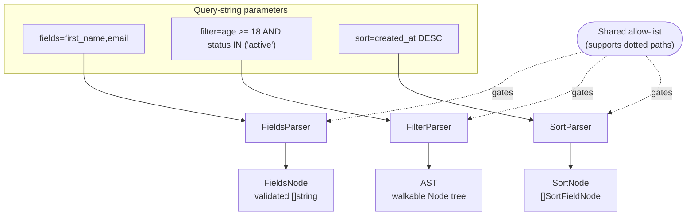

# QFV Documentation

Reference documentation for the **Query Filters Validator** (`github.com/slashdevops/qfv`).

## The three parsers at a glance

| Parser | Input example | Output | Complexity |
| --- | --- | --- | --- |
| `FieldsParser` | `first_name, email` | `FieldsNode` | comma-split validation |
| `SortParser` | `first_name ASC, created_at DESC` | `SortNode` | comma-split + direction check |
| `FilterParser` | `age >= 18 AND status IN ('active')` | AST (`Node`) | full recursive-descent grammar |

## Guides

| Guide | What it covers |
| --- | --- |
| [Getting Started](getting-started.md) | Install, update, and a complete runnable example of the three parsers |
| [Filtering](filtering.md) | The full filter grammar — every operator/predicate, dotted fields, and worked examples |
| [Configuration](configuration.md) | Restricting which operators and sort directions are allowed |
| [Error Handling](error-handling.md) | Error shapes and how to inspect validation failures |
| [Migration Guide](migration.md) | Breaking changes and how to upgrade between versions |

The full API reference is on
[pkg.go.dev](https://pkg.go.dev/github.com/slashdevops/qfv), including runnable
examples.
