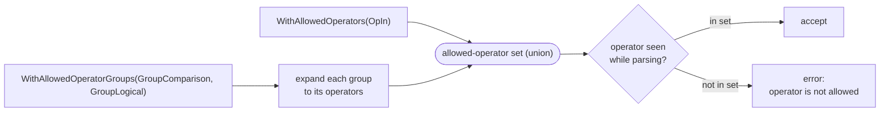
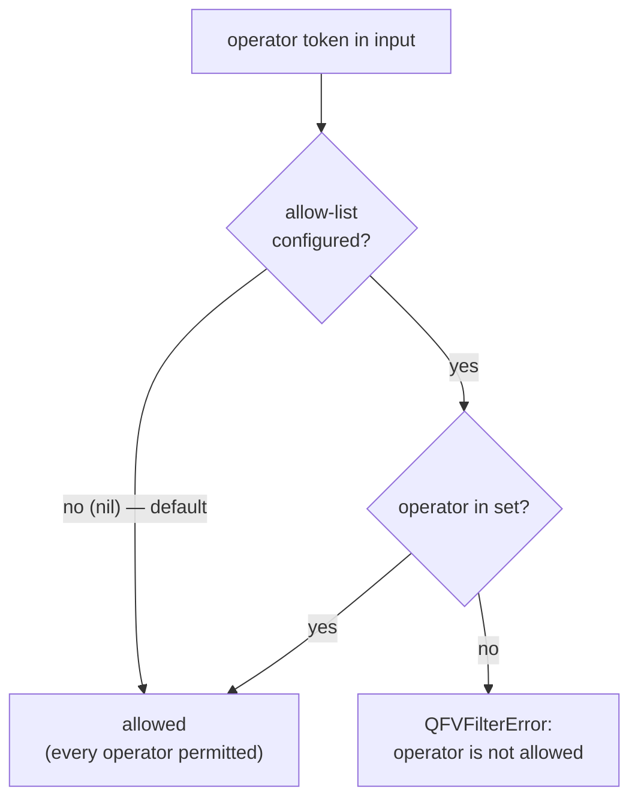
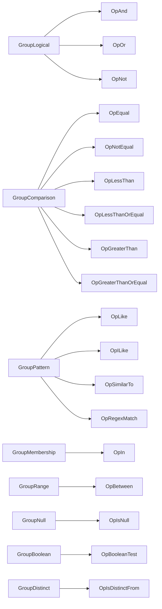
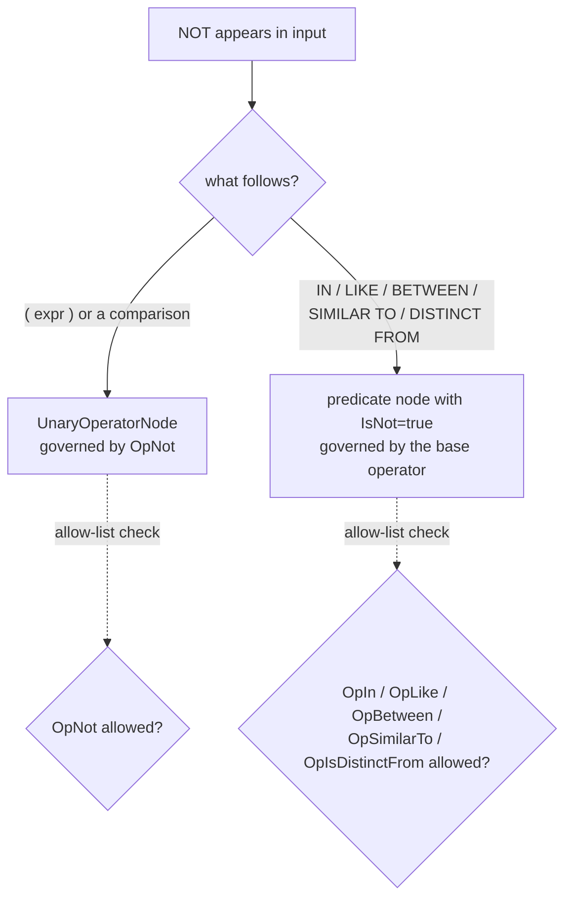

# Configuration

By default the filter parser accepts every operator and the sort parser accepts
both `ASC` and `DESC`. You can narrow either with functional options at
construction time.

## Restricting filter operators

Pass `WithAllowedOperators` and/or `WithAllowedOperatorGroups` to
`NewFilterParser`. Anything outside the allow-list is reported as a validation
error (`operator "LIKE" is not allowed`). When neither option is used, all
operators are allowed.

```go
p := qfv.NewFilterParser(fields,
    qfv.WithAllowedOperatorGroups(qfv.GroupComparison, qfv.GroupLogical),
    qfv.WithAllowedOperators(qfv.OpIn),
)

p.Parse("age >= 18 AND status IN ('active')") // ok
p.Parse("name LIKE '%x%'")                     // error: operator "LIKE" is not allowed
```

The two options are **additive** — groups expand to their operators and merge
with any individually listed operators.



### How gating decides

Every operator the parser encounters is checked against the allowed set. A
**nil** set (neither option supplied) is the default and permits everything.



### Operators

| Operator | Matches |
| --- | --- |
| `OpAnd`, `OpOr`, `OpNot` | `AND`, `OR`, standalone `NOT` |
| `OpEqual`, `OpNotEqual` | `=`; `<>` and `!=` |
| `OpLessThan`, `OpLessThanOrEqual` | `<`, `<=` |
| `OpGreaterThan`, `OpGreaterThanOrEqual` | `>`, `>=` |
| `OpLike` | `LIKE`, `NOT LIKE`, `~~`, `!~~` |
| `OpILike` | `ILIKE`, `NOT ILIKE`, `~~*`, `!~~*` |
| `OpSimilarTo` | `SIMILAR TO`, `NOT SIMILAR TO` |
| `OpRegexMatch` | `~`, `~*`, `!~`, `!~*` |
| `OpIn` | `IN`, `NOT IN` |
| `OpBetween` | `BETWEEN`, `NOT BETWEEN`, `SYMMETRIC` |
| `OpIsNull` | `IS [NOT] NULL`, `ISNULL`, `NOTNULL` |
| `OpBooleanTest` | `IS [NOT] TRUE/FALSE/UNKNOWN` |
| `OpIsDistinctFrom` | `IS [NOT] DISTINCT FROM` |

`qfv.AllOperators()` returns the complete list.

### Groups

| Group | Operators |
| --- | --- |
| `GroupLogical` | `AND`, `OR`, `NOT` |
| `GroupComparison` | `=`, `<>`, `<`, `<=`, `>`, `>=` |
| `GroupPattern` | `LIKE`, `ILIKE`, `SIMILAR TO`, regex |
| `GroupMembership` | `IN` |
| `GroupRange` | `BETWEEN` |
| `GroupNull` | `IS NULL` |
| `GroupBoolean` | `IS TRUE/FALSE/UNKNOWN` |
| `GroupDistinct` | `IS DISTINCT FROM` |

`OperatorGroup.Operators()` returns the operators a group expands to.



### Negation semantics

A negated **predicate** is governed by its base operator, not by `OpNot`:

- `NOT IN`, `NOT LIKE`, `NOT BETWEEN`, `NOT SIMILAR TO`, `IS NOT DISTINCT FROM`
  are allowed whenever `OpIn` / `OpLike` / `OpBetween` / `OpSimilarTo` /
  `OpIsDistinctFrom` (respectively) are allowed.
- `OpNot` governs only the **standalone** logical `NOT`, e.g. `NOT (age > 30)`.



So allowing `OpEqual` but not `OpNot` accepts `a = 1` but rejects `NOT (a = 1)`.

## Restricting sort directions

Pass `WithAllowedDirections` to `NewSortParser` to forbid a direction:

```go
p := qfv.NewSortParser(fields, qfv.WithAllowedDirections(qfv.SortAsc))

p.Parse("first_name ASC")  // ok
p.Parse("first_name DESC") // error: sort direction "DESC" is not allowed
```

When the option is not used, both `ASC` and `DESC` are allowed.

## Nested field names

Field allow-lists accept dotted paths in every parser (`fields`, `sort`, and
`filter`), so `user.profile.age` works out of the box — see
[Filtering › Nested field names](filtering.md#nested-dot-notation-field-names).
