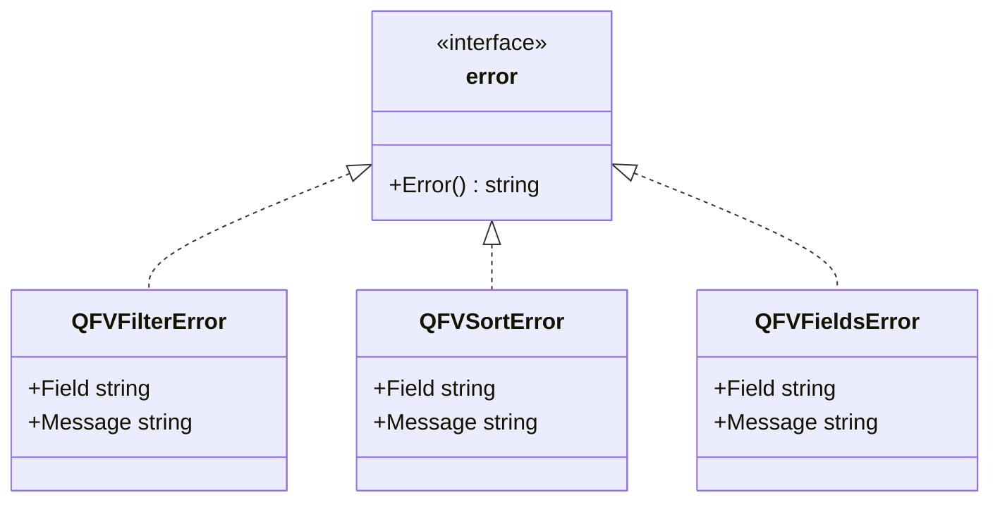
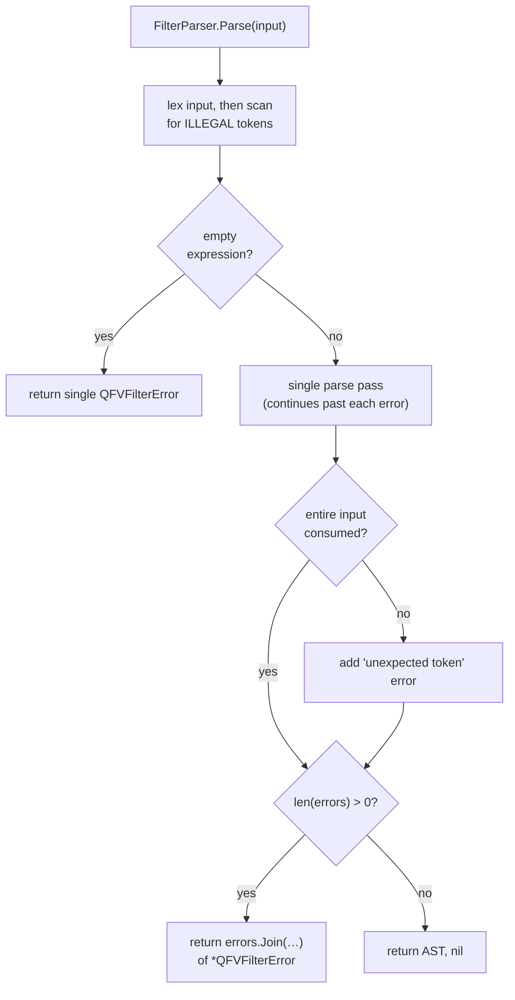

# Error Handling

Each parser returns a typed error describing what failed.

```go
_, err := filterParser.Parse("unknown_field = 'value'")
if err != nil {
    // "field 'unknown_field' is not allowed"
}

_, err = filterParser.Parse("first_name = ")
if err != nil {
    // syntax error details
}
```

## Error types

- `*QFVFilterError` — filter parser failures (has `Field` and `Message`)
- `*QFVSortError` — sort parser failures
- `*QFVFieldsError` — fields parser failures



## How the filter parser reports errors

Unlike the sort and fields parsers — which fail fast on the first problem — the
**filter** parser makes a single pass and keeps going after each error, so one
call can surface several problems at once. The collected errors are combined
with `errors.Join`.



## Aggregated filter errors

`FilterParser.Parse` collects **every** problem in a single pass and returns
them joined with [`errors.Join`](https://pkg.go.dev/errors#Join). The returned
error may therefore wrap several `*QFVFilterError` values. Use `errors.As` to
extract the first matching cause, or `errors.Is` for sentinel checks:

```go
_, err := filterParser.Parse("unknown = 'x' garbage")

var fe *qfv.QFVFilterError
if errors.As(err, &fe) {
    // fe.Field   -> "unknown"
    // fe.Message -> "field not allowed"
}
```

Because the parser continues after the first error, a single call can report,
for example, both a disallowed field and a disallowed operator at once.

## What counts as invalid

The filter parser rejects, among others:

- unknown fields (not in the allow-list),
- disallowed operators (see [Configuration](configuration.md)),
- trailing or incomplete input — the **entire** string must form one expression
  (`first_name = 'John' garbage` is an error),
- unterminated strings, unbalanced parentheses, and illegal characters.
