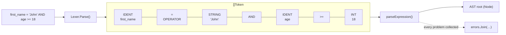
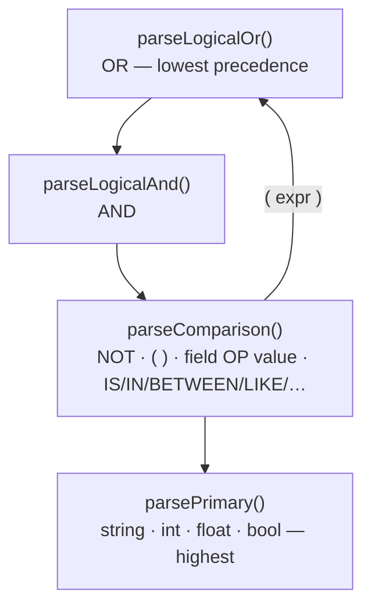
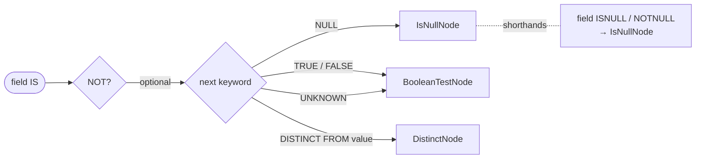
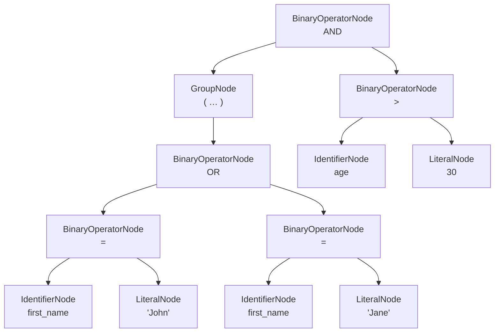
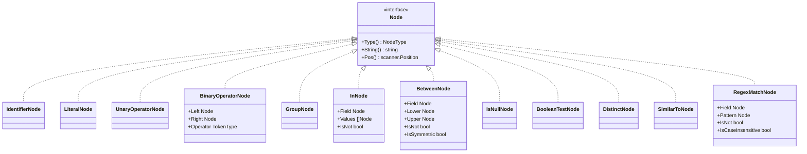

# Filtering

The filter parser validates complex boolean expressions and returns an AST. It
implements a PostgreSQL-flavored grammar; see the PostgreSQL 18 references for
[Comparison Functions and Operators](https://www.postgresql.org/docs/18/functions-comparison.html)
and [Pattern Matching](https://www.postgresql.org/docs/18/functions-matching.html).

```go
filterParser := qfv.NewFilterParser(allowedFields)
node, err := filterParser.Parse("first_name = 'John' AND age >= 18")
```

The parser guarantees that:

- only allow-listed fields are used,
- the syntax is valid and the **entire** input is consumed,
- the result is a well-formed AST.

## How the filter parser works

Parsing is a two-stage pipeline. The `Lexer` first turns the raw string into a
flat list of tokens; the recursive-descent parser then consumes those tokens to
build the AST, checking each field against the allow-list and each operator
against the (optional) operator allow-list as it goes.



### Operator precedence

The parser encodes precedence as a ladder of methods. `OR` binds loosest and is
tried first; each level descends to the next tighter-binding one, and a
parenthesized group re-enters the ladder at the top.



So `a = 1 OR b = 2 AND c = 3` parses as `a = 1 OR (b = 2 AND c = 3)` — `AND`
binds tighter than `OR`.

## Supported operators

| Category | Operators |
| --- | --- |
| Logical | `AND`, `OR`, `NOT` |
| Comparison | `=`, `<>`, `!=`, `<`, `<=`, `>`, `>=` |
| Range | `BETWEEN`, `NOT BETWEEN`, `BETWEEN SYMMETRIC`, `NOT BETWEEN SYMMETRIC` (explicit `ASYMMETRIC` is the default) |
| Set membership | `IN`, `NOT IN` |
| Null tests | `IS NULL`, `IS NOT NULL`, and the non-standard `ISNULL` / `NOTNULL` shorthands |
| Boolean tests | `IS TRUE`, `IS NOT TRUE`, `IS FALSE`, `IS NOT FALSE`, `IS UNKNOWN`, `IS NOT UNKNOWN` |
| Null-safe comparison | `IS DISTINCT FROM`, `IS NOT DISTINCT FROM` |
| Pattern matching | `LIKE`, `NOT LIKE` (`~~`, `!~~`); `ILIKE`, `NOT ILIKE` (`~~*`, `!~~*`); `SIMILAR TO`, `NOT SIMILAR TO` |
| POSIX regex | `~` (match), `!~` (non-match), `~*` (case-insensitive match), `!~*` (case-insensitive non-match) |
| Grouping | `( ... )` |

**Literals**: single-quoted strings (`''` escapes a quote), integers, floats,
and booleans (`TRUE`/`FALSE`/`YES`/`NO`).

## Nested (dot-notation) field names

Field names may contain dots, so you can allow-list and filter on nested paths:

```go
p := qfv.NewFilterParser([]string{"user.profile.age", "user.name"})
node, _ := p.Parse("user.profile.age >= 18 AND user.name = 'John'")
// ((user.profile.age >= 18) AND (user.name = 'John'))
```

A dot is only valid **inside** an identifier, so numeric literals such as `3.14`
are unaffected. Unknown dotted fields are rejected by the allow-list like any
other field.

## The `IS` predicate family

`IS` is a single entry point into several predicates. After consuming `IS` (and
an optional `NOT`), the parser branches on the next keyword to build the right
node:



## Worked examples

```go
// Simple comparison
"first_name = 'John'"

// Logical operators
"first_name = 'John' AND last_name = 'Doe'"
"first_name = 'John' OR first_name = 'Jane'"
"NOT (first_name = 'John')"

// Comparison operators
"age > 30"
"age <> 30"   // not equal
"age != 30"   // not equal (alias)

// Pattern matching
"first_name LIKE 'J%'"
"first_name NOT LIKE 'J%'"
"first_name ILIKE 'j%'"            // case-insensitive
"first_name NOT ILIKE 'j%'"
"name SIMILAR TO 'J%n'"            // SQL-standard regex
"name NOT SIMILAR TO 'J%n'"

// Set membership & ranges
"status IN ('active', 'pending')"
"status NOT IN ('archived')"
"age BETWEEN 20 AND 30"
"age NOT BETWEEN 20 AND 30"
"age BETWEEN SYMMETRIC 30 AND 20"  // endpoints auto-sorted

// Null / boolean / null-safe tests
"middle_name IS NULL"
"middle_name IS NOT NULL"
"middle_name ISNULL"               // shorthand
"middle_name NOTNULL"              // shorthand
"active IS TRUE"
"active IS NOT FALSE"
"active IS UNKNOWN"
"age IS DISTINCT FROM 30"          // null-safe !=
"age IS NOT DISTINCT FROM 30"      // null-safe =

// POSIX regex
"email ~ '^[^@]+@[^@]+\.[^@]+$'"   // case-sensitive match
"email !~ '^[^@]+@[^@]+\.[^@]+$'"  // case-sensitive non-match
"email ~* '(?i)^admin@'"           // case-insensitive match
"email !~* '(?i)^admin@'"          // case-insensitive non-match

// Complex expressions
"(first_name = 'John' OR first_name = 'Jane') AND age > 30"
"status IN ('active', 'pending') AND created_at > '2023-01-01'"
```

## AST nodes

`Parse` returns a `qfv.Node` — the root of a tree you can walk or render.
For example, the expression

```text
(first_name = 'John' OR first_name = 'Jane') AND age > 30
```

parses into this tree (precedence makes `AND` the root, with the parenthesized
`OR` on its left):



Every node implements the `Node` interface, so you can type-switch on the
concrete types to walk or transform the tree:



Common concrete types:

| Node | Produced by |
| --- | --- |
| `BinaryOperatorNode` | comparisons, `AND`/`OR`, `LIKE`/`ILIKE` |
| `UnaryOperatorNode` | a standalone leading `NOT` |
| `GroupNode` | parenthesized expressions |
| `InNode` | `IN` / `NOT IN` (`IsNot`) |
| `BetweenNode` | `BETWEEN` (`IsNot`, `IsSymmetric`) |
| `IsNullNode` | `IS [NOT] NULL`, `ISNULL`/`NOTNULL` (`IsNot`) |
| `BooleanTestNode` | `IS [NOT] TRUE/FALSE/UNKNOWN` (`Value`, `IsNot`) |
| `DistinctNode` | `IS [NOT] DISTINCT FROM` (`Value`, `IsNot`) |
| `SimilarToNode` | `SIMILAR TO` / `NOT SIMILAR TO` (`IsNot`) |
| `RegexMatchNode` | `~ ~* !~ !~*` (`IsNot`, `IsCaseInsensitive`) |
| `IdentifierNode` / `LiteralNode` | field names / literal values |

Every node implements `Type() NodeType`, `String() string`, and
`Pos() scanner.Position`.

> **Patterns are not compiled.** For `LIKE`/`ILIKE`/`SIMILAR TO`/regex operators
> the parser only checks that the right-hand side is a string literal. If you
> evaluate the pattern with Go's `regexp`, compile/validate it yourself.
> Single-quoted string literals keep backslashes verbatim (only `''` is an
> escape), so `'^\d+$'` reaches you with the backslash intact.

## See also

- [Configuration](configuration.md) — allow only a subset of these operators
- [Error Handling](error-handling.md)
