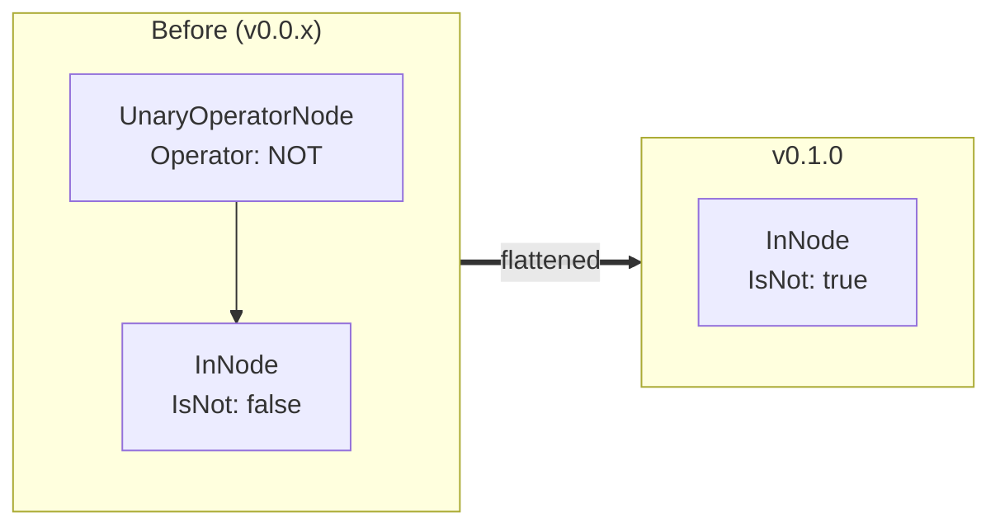

# Migration Guide

## v0.0.x → v0.1.0

`v0.1.0` fixes correctness bugs in the filter parser, adds the PostgreSQL 18
predicate set, and introduces configurable operators/directions and dotted
field names. If you only call `Parse` and check the returned `error`, most
changes are transparent — the parser now rejects inputs it previously accepted
by mistake. If you **inspect the returned AST**, review the notes below.

### 1. Trailing/incomplete input is now rejected (behavior change)

Previously the parser stopped at the first complete expression and silently
ignored the rest, so invalid input validated successfully. It now requires the
**entire** input to be consumed.

| Input | Before | `v0.1.0` |
| --- | --- | --- |
| `first_name = 'John' garbage` | ✅ accepted | ❌ error |
| `age > 30 40` | ✅ accepted | ❌ error |
| `first_name = 'John')` | ✅ accepted | ❌ error |
| `1 = 1` | ✅ accepted | ❌ error |

**Migration:** none required for valid queries. If you relied on the lenient
behavior, fix the offending inputs — they were never valid.

### 2. Negated operators set `IsNot` instead of wrapping in `UnaryOperatorNode` (AST change)

`NOT IN`, `NOT BETWEEN`, `NOT SIMILAR TO`, and `NOT DISTINCT FROM` previously
produced a `UnaryOperatorNode{Operator: NOT}` wrapping the inner node (whose own
`IsNot` was always `false`). They now return the operator node directly with
`IsNot = true`, matching how `RegexMatchNode` already worked. `NOT LIKE` now
produces a `BinaryOperatorNode` with `Operator = TokenOperatorNotLike`.

For example, `status NOT IN ('archived')` changed shape:



```go
// Before: type-switch had to unwrap the NOT node
if u, ok := node.(*qfv.UnaryOperatorNode); ok && u.Operator == qfv.TokenOperatorNot {
    if in, ok := u.X.(*qfv.InNode); ok { /* negated IN */ }
}

// After: the node carries its own negation
if in, ok := node.(*qfv.InNode); ok && in.IsNot { /* negated IN */ }
```

The `IsNot` fields on `InNode`, `BetweenNode`, `SimilarToNode`, and
`DistinctNode` are now meaningful, `Type()` returns the corresponding
`NodeTypeNotIn` / `NodeTypeNotBetween` / `NodeTypeNotSimilarTo` /
`NodeTypeNotDistinct`, and `String()` renders the `NOT`/`IS NOT` form.

> A standalone leading `NOT` (e.g. `NOT (age > 30)`) is unchanged — it still
> produces a `UnaryOperatorNode`.

### 3. `DistinctNode` gained a `Value` field (AST change)

`IS [NOT] DISTINCT FROM <value>` previously discarded the compared value.
`DistinctNode` now holds it:

```go
type DistinctNode struct {
    Field Node
    Value Node // NEW: the right-hand side value (nil when absent)
    IsNot bool
}
```

Its `String()` now renders the canonical `field IS [NOT] DISTINCT FROM value`.

### 4. `Parse` returns a joined error (error shape change)

`FilterParser.Parse` returns `errors.Join(...)` of `*QFVFilterError` values
rather than a single formatted string. Use `errors.As` / `errors.Is` to inspect
causes — see [Error Handling](error-handling.md). Code that only checks
`err != nil` is unaffected.

### 5. `FilterParser` is safe for concurrent use

A single `*FilterParser` (like `*SortParser` and `*FieldsParser`) can now be
created once and shared across goroutines; per-request state is no longer stored
on the parser. No API change — this removes a data race.

### 6. New PostgreSQL 18 predicates (additive)

The grammar gained the following; existing queries keep parsing:

| Predicate / operator | AST |
| --- | --- |
| `ILIKE`, `NOT ILIKE` (and `~~`, `~~*`, `!~~`, `!~~*`) | `BinaryOperatorNode` with `ILIKE`/`NOT ILIKE` (or `LIKE`/`NOT LIKE`) |
| `IS [NOT] TRUE/FALSE/UNKNOWN` | new `BooleanTestNode{Field, Value, IsNot}` |
| `IS [NOT] DISTINCT FROM <value>` | `DistinctNode` via the standard `IS` form |
| `BETWEEN [NOT] SYMMETRIC` (explicit `ASYMMETRIC`) | `BetweenNode.IsSymmetric` |
| `ISNULL`, `NOTNULL` shorthands | `IsNullNode` (`IsNot=true` for `NOTNULL`) |

### 7. Constructors accept functional options (source-compatible)

`NewFilterParser(fields)` and `NewSortParser(fields)` gained variadic options:

```go
func NewFilterParser(allowedFields []string, opts ...FilterOption) *FilterParser
func NewSortParser(allowedFields []string, opts ...SortOption) *SortParser
```

Existing calls compile unchanged. See [Configuration](configuration.md) for
`WithAllowedOperators`, `WithAllowedOperatorGroups`, and `WithAllowedDirections`.

### 8. Dotted field names (additive)

Field names may now contain dots (`user.profile.age`) in all three parsers.
Numeric literals such as `3.14` are unaffected. See
[Filtering › Nested field names](filtering.md#nested-dot-notation-field-names).
