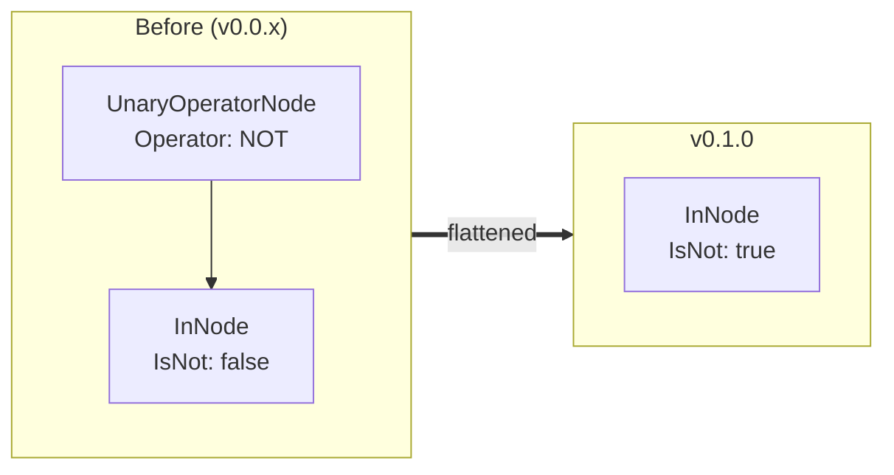

# Migration Guide

## v1.0.2 → v1.0.3

`v1.0.3` makes the filter parser refuse what PostgreSQL refuses as a syntax
error. A caller that passed one of these inputs through now gets the parser's
error instead of the database's.

| Input | v1.0.2 | v1.0.3 | PostgreSQL 18 |
| --- | --- | --- | --- |
| `id DISTINCT FROM 1`, `id NOT DISTINCT FROM 1` | ✅ accepted | ❌ error | syntax error: write `IS [NOT] DISTINCT FROM` |
| `price = 0x1p-2` (a hexadecimal float) | ✅ accepted | ❌ error | trailing junk after numeric literal |
| `id=1AND name='x'` (a word glued to a number) | ✅ accepted | ❌ error | trailing junk after numeric literal |
| `active IS YES`, `active IS NOT NO` | ✅ accepted | ❌ error | syntax error: `IS` takes `TRUE`, `FALSE`, `UNKNOWN`, `NULL` |
| `name NOT ~~ 'x'`, `name NOT ~~* 'x'` | ✅ accepted | ❌ error | syntax error: write `NOT LIKE` or `!~~` |

Three more refusals, of input no client writes by accident:

| Input | v1.0.2 | v1.0.3 |
| --- | --- | --- |
| a keyword spelled with a non-ASCII letter (`name lıke 'x'`, `id Iſ NULL`, `name aſc` in a sort) | ✅ accepted | ❌ error: PostgreSQL folds case in ASCII only, and reads these as names |
| an expression that starts with a byte order mark (U+FEFF) | ✅ accepted, the mark dropped | ❌ error |
| an expression nested more than 100 levels deep (`((((…`, `NOT NOT NOT …`) | ✅ accepted, or **the process ended**: about 250 000 opening parentheses overflow the stack, a fatal error no `recover` catches | ❌ error |

The last one is a reason to upgrade whatever else you do, if the expression
comes from a request: bound its length before calling `Parse`, too.

**One input that ran is now refused:** a float written with `_` separators
(`price = 1_000.5`, `1e1_0`). v1.0.2 refused the integer form (`1_000`) and
accepted the float by accident of how each was converted; PostgreSQL 16 and
later run both. A number is now decimal digits, a point and an exponent, for
integers and floats alike. Write `1000.5`.

**One input that was refused is now accepted:** a negative number.

| Input | v1.0.2 | v1.0.3 |
| --- | --- | --- |
| `id = -1`, `id IN (-1, 2)`, `age BETWEEN -5 AND 5` | ❌ error | ✅ accepted |

The sign is part of the literal: `LiteralNode.Text` is `-1` and `Value` is
`int64(-1)`. It must be glued to the number, and not to an operator written
with `!` or `~`: `id !=-1` is refused, because PostgreSQL reads `!=-` as one
operator. The parser still does not know a column's type, so a negative
number is accepted wherever a literal is (`name LIKE -1`, a bare `-1`), as a
positive one already was; PostgreSQL refuses those for their type. See
[Filtering › Numbers](filtering.md#numbers).

**Error messages and tokens.** For an input that was and is refused, the text
can differ: `0x10`, `0b101`, `0o17` and `1_000` are `illegal token` (it was
`invalid integer`), and a word glued to a number is one illegal token named
whole (`error on field '1name': illegal token`). `Lexer` users: `-` followed
by a digit or a point is no longer its own illegal token but the start of an
`INT` or `FLOAT` whose `Value` carries the sign.

**Migration:** replace `x [NOT] DISTINCT FROM y` with `x IS [NOT] DISTINCT FROM
y`, and write numbers without `_`.

## v0.0.x → v0.1.0

`v0.1.0` fixes correctness bugs in the filter parser, adds the PostgreSQL 18
predicate set, and introduces configurable operators/directions and dotted
field names. If you only call `Parse` and check the returned `error`, most
changes are transparent — the parser now rejects inputs it previously accepted
by mistake. If you **inspect the returned AST**, review the notes below.

### 1. Trailing/incomplete input is now rejected (behavior change)

Previously the parser stopped at the first complete expression and silently
ignored the rest, so invalid input validated successfully. It now requires the
**entire** input to be consumed.

| Input | Before | `v0.1.0` |
| --- | --- | --- |
| `first_name = 'John' garbage` | ✅ accepted | ❌ error |
| `age > 30 40` | ✅ accepted | ❌ error |
| `first_name = 'John')` | ✅ accepted | ❌ error |
| `1 = 1` | ✅ accepted | ❌ error |

**Migration:** none required for valid queries. If you relied on the lenient
behavior, fix the offending inputs — they were never valid.

### 2. Negated operators set `IsNot` instead of wrapping in `UnaryOperatorNode` (AST change)

`NOT IN`, `NOT BETWEEN`, `NOT SIMILAR TO`, and `NOT DISTINCT FROM` previously
produced a `UnaryOperatorNode{Operator: NOT}` wrapping the inner node (whose own
`IsNot` was always `false`). They now return the operator node directly with
`IsNot = true`, matching how `RegexMatchNode` already worked. `NOT LIKE` now
produces a `BinaryOperatorNode` with `Operator = TokenOperatorNotLike`.

For example, `status NOT IN ('archived')` changed shape:


```mermaid
flowchart LR
    subgraph before["Before (v0.0.x)"]
        direction TB
        U["UnaryOperatorNode<br/>Operator: NOT"] --> I1["InNode<br/>IsNot: false"]
    end

    subgraph after["v0.1.0"]
        direction TB
        I2["InNode<br/>IsNot: true"]
    end

    before ==>|"flattened"| after
```

```go
// Before: type-switch had to unwrap the NOT node
if u, ok := node.(*qfv.UnaryOperatorNode); ok && u.Operator == qfv.TokenOperatorNot {
    if in, ok := u.X.(*qfv.InNode); ok { /* negated IN */ }
}

// After: the node carries its own negation
if in, ok := node.(*qfv.InNode); ok && in.IsNot { /* negated IN */ }
```

The `IsNot` fields on `InNode`, `BetweenNode`, `SimilarToNode`, and
`DistinctNode` are now meaningful, `Type()` returns the corresponding
`NodeTypeNotIn` / `NodeTypeNotBetween` / `NodeTypeNotSimilarTo` /
`NodeTypeNotDistinct`, and `String()` renders the `NOT`/`IS NOT` form.

> A standalone leading `NOT` (e.g. `NOT (age > 30)`) is unchanged — it still
> produces a `UnaryOperatorNode`.

### 3. `DistinctNode` gained a `Value` field (AST change)

`IS [NOT] DISTINCT FROM <value>` previously discarded the compared value.
`DistinctNode` now holds it:

```go
type DistinctNode struct {
    Field Node
    Value Node // NEW: the right-hand side value (nil when absent)
    IsNot bool
}
```

Its `String()` now renders the canonical `field IS [NOT] DISTINCT FROM value`.

### 4. `Parse` returns a joined error (error shape change)

`FilterParser.Parse` returns `errors.Join(...)` of `*QFVFilterError` values
rather than a single formatted string. Use `errors.As` / `errors.Is` to inspect
causes — see [Error Handling](error-handling.md). Code that only checks
`err != nil` is unaffected.

### 5. `FilterParser` is safe for concurrent use

A single `*FilterParser` (like `*SortParser` and `*FieldsParser`) can now be
created once and shared across goroutines; per-request state is no longer stored
on the parser. No API change — this removes a data race.

### 6. New PostgreSQL 18 predicates (additive)

The grammar gained the following; existing queries keep parsing:

| Predicate / operator | AST |
| --- | --- |
| `ILIKE`, `NOT ILIKE` (and `~~`, `~~*`, `!~~`, `!~~*`) | `BinaryOperatorNode` with `ILIKE`/`NOT ILIKE` (or `LIKE`/`NOT LIKE`) |
| `IS [NOT] TRUE/FALSE/UNKNOWN` | new `BooleanTestNode{Field, Value, IsNot}` |
| `IS [NOT] DISTINCT FROM <value>` | `DistinctNode` via the standard `IS` form |
| `BETWEEN [NOT] SYMMETRIC` (explicit `ASYMMETRIC`) | `BetweenNode.IsSymmetric` |
| `ISNULL`, `NOTNULL` shorthands | `IsNullNode` (`IsNot=true` for `NOTNULL`) |

### 7. Constructors accept functional options (source-compatible)

`NewFilterParser(fields)` and `NewSortParser(fields)` gained variadic options:

```go
func NewFilterParser(allowedFields []string, opts ...FilterOption) *FilterParser
func NewSortParser(allowedFields []string, opts ...SortOption) *SortParser
```

Existing calls compile unchanged. See [Configuration](configuration.md) for
`WithAllowedOperators`, `WithAllowedOperatorGroups`, and `WithAllowedDirections`.

### 8. Dotted field names (additive)

Field names may now contain dots (`user.profile.age`) in all three parsers.
Numeric literals such as `3.14` are unaffected. See
[Filtering › Nested field names](filtering.md#nested-dot-notation-field-names).
